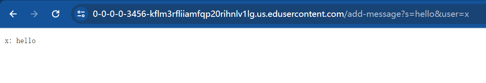
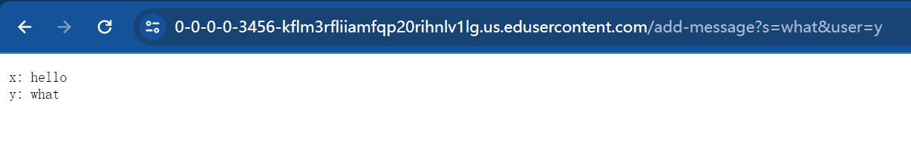

# Lab Report 2
## Part 1
### CharServer.java
```
import java.io.IOException;
import java.net.URI;
import java.util.ArrayList;

class Handler implements URLHandler {
    ArrayList<String> arr = new ArrayList<>();

    public String handleRequest(URI url) {
        if (url.getPath().equals("/")) {
            return "";
        } else if (url.getPath().contains("/add-message")) {
            String[] parameters = url.getQuery().split("&");
            String[] s = parameters[0].split("=");
            String[] user = parameters[1].split("=");
            if (s[0].equals("s") && user[0].equals("user")) {
                String addedLine = user[1] + ": " + s[1] + "\n";
                arr.add(addedLine);
                return String.join("", arr);
            }
        }
        return "Invalid input.";
    } 
}

class CharServer {
    public static void main(String[] args) throws IOException {
        if(args.length == 0){
            System.out.println("Missing port number! Try any number between 1024 to 49151");
            return;
        }

        int port = Integer.parseInt(args[0]);
        Server.start(port, new Handler());
    }
}
```

### Server.java
```
import java.io.IOException;
import java.io.OutputStream;
import java.net.InetSocketAddress;
import java.net.URI;

import com.sun.net.httpserver.HttpExchange;
import com.sun.net.httpserver.HttpHandler;
import com.sun.net.httpserver.HttpServer;

interface URLHandler {
    String handleRequest(URI url);
}

class ServerHttpHandler implements HttpHandler {
    URLHandler handler;
    ServerHttpHandler(URLHandler handler) {
      this.handler = handler;
    }
    public void handle(final HttpExchange exchange) throws IOException {
        try {
            String ret = handler.handleRequest(exchange.getRequestURI());
            exchange.sendResponseHeaders(200, ret.getBytes().length);
            OutputStream os = exchange.getResponseBody();
            os.write(ret.getBytes());
            os.close();
        } catch(Exception e) {
            String response = e.toString();
            exchange.sendResponseHeaders(500, response.getBytes().length);
            OutputStream os = exchange.getResponseBody();
            os.write(response.getBytes());
            os.close();
        }
    }
}

public class Server {
    public static void start(int port, URLHandler handler) throws IOException {
        HttpServer server = HttpServer.create(new InetSocketAddress(port), 0);
        server.createContext("/", new ServerHttpHandler(handler));
        server.start();
        System.out.println("Server Started!");
    }
}
```

### Screenshot 1

* The method **handleRequest** is called.
* The argument is "https://0-0-0-0-3456-kflm3rfliiamfqp20rihnlv1lg.us.edusercontent.com/add-message?s=hello&user=x", and the part **add-message?s=hello&user=x** is what relevant to the output.
* Relevant fields include:
  * parameters = ["s=hello", "user=x"]
  * s = "hello"
  * user = "x"
  * addedLine = "x: hello\n"
  * arr = ["x: hello\n"]
* The fields inside **handleRequest** method including **parameters**, **s**, **user**, and **addedLine** are changed by the specific strings from the argument. The fields of **Handler** class **arr** is originally an empty ArrayList, and the String **addedLine** is appended to the ArrayList after calling this method.

### Screenshot 2

* The method **handleRequest** is called.
* The argument is "https://0-0-0-0-3456-kflm3rfliiamfqp20rihnlv1lg.us.edusercontent.com/add-message?s=what&user=y", and the part **add-message?s=what&user=y** is what relevant to the output.
* Relevant fields include:
  * parameters = ["s=what", "user=y"]
  * s = "what"
  * user = "y"
  * addedLine = "y: what\n"
  * arr = ["x: hello\n", "y: what\n"]
* The fields inside **handleRequest** method including **parameters**, **s**, **user**, and **addedLine** are changed by the specific strings from the argument. The fields of **Handler** class **arr** originally contains one element **"x: hello\n"** appended by the previous call of the method, and after it is called this time, the new value of **addedLine**, which is **"y: what\n"**, is appended to the ArrayList.
