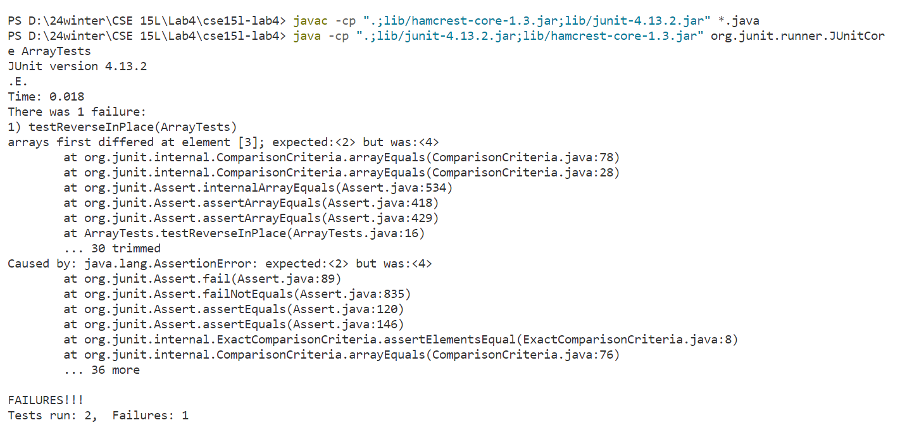

## Lab Report 3
### Part 1 - Bugs
The bug I chose is from the method reverseInPlace() in ArrayExamples.
```
public class ArrayExamples {
  static void reverseInPlace(int[] arr) {
    for(int i = 0; i < arr.length; i += 1) {
      arr[i] = arr[arr.length - i - 1];
    }
  }
```
1. A failure-inducing input for the buggy program, as a JUnit test and any associated code
   ```
   @Test
   public void testReverseInPlace() {
     int[] input1 = {1, 2, 3, 4, 5};
     ArrayExamples.reverseInPlace(input1);
     assertArrayEquals(new int[]{5, 4, 3, 2, 1}, input1);
   }
   ```
2. An input that doesn't induce a failure, as a JUnit test and any associated code
   ```
   @Test
   public void testReverseInPlace() {
     int[] input2 = {1};
     ArrayExamples.reverseInPlace(input2);
     assertArrayEquals(new int[]{1}, inpu2);
   }
   ```
3. The symptom, as the output of running the tests
   
4. The bug, as the before-and-after code change required to fix it  
   Before:
   ```
   static void reverseInPlace(int[] arr) {
     for(int i = 0; i < arr.length; i += 1) {
       arr[i] = arr[arr.length - i - 1];
     }
   }
   ```
   After:
   ```
   static void reverseInPlace(int[] arr) {
     int[] temArray = new int[arr.length];
     for(int i = 0; i < arr.length; i += 1) {
       temArray[i] = arr[arr.length - i - 1];
     }
     for(int i = 0; i < arr.length; i += 1) {
       arr[i] = temArray[i];
     }
   }
   ```
   Explanation:
   In reverseInPlace(), when we replace the data in index i with another that in another index, the original data is lost and we can not get any of the first half of original data in this way. To fix this, I created a new array to store everything in reversed order, and then copied everything from the new array to the original one. In this way, the data inside the array can be correctly reversed. 

### Part 2 - Researching Commands
**My choice:** grep  
**Source:** [https://www.geeksforgeeks.org/grep-command-in-unixlinux/](https://www.geeksforgeeks.org/grep-command-in-unixlinux/)  
**Note:** Some outputs are super long. For the sake of brevity and readability, I only keep the first and last several lines of them.  
**Use -h as the option:**  
It displays the block of all matched lines, but not the filenames. It is useful when I only want to get the sentences that contain the keyword, maybe for research purpose.
```
$ grep -h "world" biomed/*.txt
        sold commericially and used as a biopesticide worldwide for
        surrounding Bt use has sparked worldwide debate over
        budworm, a worldwide pest of numerous valuable crops such
          In an ideal world, we could empirically estimate the
        the collective dynamics of a "small-world" network such
        systems with small-world coupling display enhanced
        least in the prokaryotic world, comparison of trees for
        simulate "the real world," it remains evident that we as
        enthusiastic application of PD to real world situations, we
        rather than studying the taxon worldwide.
        world. Flowering time - defined as the time that elapses
        D. melanogaster around the world.
        million people worldwide at risk for developing significant
        great apes and old world monkeys [ 3 ] , and the autosomal 
        psychiatric disorders each affecting about 1% of the world
        phases of the evolution of the protein world, and
        around the world can be sequenced.
        Today, an estimated one-third of the world's population
        pressing in third world countries, where demographics and
        parasites throughout the world, a need for a fundamental
        was practiced with sporadic successes worldwide in the
        represent an enormous health problem for children worldwide
        Brucellosis is a worldwide zoonotic disease caused by a
        world. In those countries where the disease has been
        world experiencing high incidence of brucellosis may not
        brucellosis outbreaks worldwide.
        human and economic toll it exacts throughout the world, the
        experienced by children, affecting up to 5% of the world's
        murine taste world in many ways differs from that of
        that affect a large number of people all over the world. It
        for 400,000 births world-wide annually.
        world. Despite the existence of substantial diversity among
        sets and its easy-to-use, TOF-Guard is worldwide no longer
        to US$ 27 for two test in developed world. These prices
        Smallpox, while not found in the world's population at
        LYA, as Project Director for the NIDDK, is a world
        population. Hence, for areas of the world that do not have
        of death in women 30 to 70 years of age in the world.
        ...
            and that the whole world of medical research and
          about the external world face the tribunal of sense
        in applications to real world signals. The trap in this
        developed world [ 3 ] , is in particular tied to that of
        world" and their impact on the work environment. [ 7 ]
        critically ill patients throughout the developed world.
        a matter of worldwide concern. Selective pressure by
        worldwide [ 1 2 ] . CC arises by distinct morphologic
        in India is second highest in the world. Among males the
        disease of unknown etiology. Its worldwide prevalence is
        world-renowned orthopedic hospital treating difficult cases
        adult individuals worldwide. Primary FLS cultures can be
        cancer capital of the world' [ 3 ] , and heightened
        world and is now the most common cancer in Nigeria [ 1 2 3
        breast cancer rates in the world [ 1 2 ] . Within this
        the United States and worldwide [ 1 ] . While cures are
        Throughout the world, the shortage of donor organs has
        With the increasing worldwide availability of liver
        infection [ 1]. The incidence of sepsis worldwide is on the
          is a function of the prevalence of trauma in our world
        surgeons worldwide. During the 1980s and 1990s in the USA,
        the world. It is found in 50-80% of some populations [ 27].
        are now over 100 centers worldwide capable of and
        of the world by physicians based in North America is
        The company reports performance of 200 cases worldwide
        interface with the microbial world. As such, the primary
        applicability of this method to real-world samples, we
          accessible through a worldwide web interface [ 19]. A
        because, as the most important food crop in the world, much
        widespread throughout the prokaryotic world. Homologs of
        cancer worldwide [ 9, 10]. Through the examination of
          prevalent in the viral world. This prediction was also
        by investigators from around the world, using a variety of
        throughout the tropical and subtropical world. Of these
        to a flat view of the biological world. Whereas GoMiner
        damage worldwide [ 2 ] . The most damaging family (the
        Africa, where nearly 90% of the world's malaria-specific
        increasing in the USA and around the world, the minority of
```
```
$ grep -h "world" plos/*.txt
        the world scientific community closer to each other (Annan 2003). Mr. Annan stressed the
        and development, had approximately 72% of the world researchers, and produced approximately
        produced annually, with 36.6% and 37.5%, respectively, worldwide (UNESCO 2001).
        the world (Gibbs 1995; May 1997; Alonso and Fernández-Juricic 2001; Vohora and Vohora
        developing worlds actually remaining unchanged or even increasing, as Mr. Annan has
        respectively, only 1.8% and 2% of scientific publications worldwide, have increased the
        publications between the developed world and the developing world from 1990 until 2000,
        cheaper in the developing world due to relatively low researcher salaries, overhead and
        North America accounted for 62% of the publications worldwide. Within the Americas,
        examined it in respect to worldwide publications. In this case, the United States
        (Swinbanks et al. 1997) and thus could be a general phenomenon in the developing world.
        Although there are outstanding scientific researchers in the developing world who
        and that the top journals, which are published in the developed world, respond more to the
        locally in the developing world is overlooked. But it takes more than publishing good
        meetings for researchers in the developing compared with the developed world.
        developing world (Goldemberg 1998; Annan 2003). One is that science, as a discipline, would
        benefit from the contributions of many disparate groups around the world, rather than being
        critical for the developing world to promote, through research and publications, those
        industrialized world. This has been the case for research on renewable energy sources in
        examples are important not only for those regions of the developing world, but are also in
        world.
        ...
        Increased attention should be paid to these diseases not just in the developed world,
        but also in the developing world, where the unfinished agendas on communicable disease and
        There are 300 million cases of malaria each year worldwide, causing one million deaths.
        Around two-fifths of the world's population are now at risk of the disease (one estimate
        worldwide. Of all the different virus subtypes (A, B, C, D, F, G, H, J, and K) and a
        world. Antiretroviral drugs were developed by studying subtype B, and most data on the
        genetic mechanisms of HIV drug resistance are also from subtype B. However, worldwide,
        PLoS Medicine , Rami Kantor and colleagues from a worldwide collaboration
        certainly stretch far back into antiquity. In the developed world, medical schools are now
        from the pharmaceutical industry and the importance of students worldwide having unfettered
        worldwide, about 30% of total global deaths. Many of these deaths could be prevented by
        proportion of the world's population living in low-income and middle-income countries
        developing world; as a result, low-income and middle-income countries will simultaneously
        interventions are pursued, we will face a world in which all major diseases are the
        heterogeneity of the HIV-infected population. The most important “real world” result is
        in this role to serve the world's varying biomedical researchers and clinicians?
        For example, 55 institutions worldwide have so far signed the Berlin Declaration on Open
        remains the second major cause of preventable death in the world and fourth most common
        risk factor for disease worldwide [59]. While tobacco is clearly a worldwide concern,
        world regarding the forced opening of tobacco markets as a result of the Global Agreements
        We believe that the future of low-cost diagnostics for use in the developing world lies
        importance of microtechnologies to the realities of laboratory infrastructure worldwide has
        research groups around the world have worked on vaccine development—and their efforts have
        across the country and around the world. It would be unfortunate indeed if medical
        multicellular worms. The diseases caused by these organisms represent some of the world's
        in the tropical world [2], and a recent meta-analysis showed that the disease is
        poor and living in poor regions of the world. They represent little or no viable market for
        developed world). At the same time, academic- and nonprofit-institute scientists are
        worldwide and justified its decisive action in issuing a global alert.
        of the 40 million people with HIV/AIDS worldwide [1]. The HIV prevalence among adults in
        130 million, Nigeria is home to one in 11 of the 40 million PLWA worldwide. Around 6% of
        Approximately 40% of the world's population, mostly living in the world's poorest
        countries, is at risk of malaria. In the tropical and subtropical regions of the world,
        observed for other respiratory viruses. But they noted that HCoV-NL63 has spread worldwide,
        In the lonely and, at times, discouraging world of whistleblowing, we whistleblowers are
        2005): “To leave the world a bit better, whether by a healthy child, a garden patch or a
```

**Use -l as the option:**  
It displays list of a filenames that include the pattern of characters. It is useful when I only want to find the files that contain the keyword. For example, if I want to find the articles about New York in a bunch of newspapers, I can use this option to get the newspapers I need.
```
$ grep -l "world" biomed/*.txt
biomed/1471-2091-2-12.txt
biomed/1471-2091-2-16.txt
biomed/1471-2105-2-8.txt
biomed/1471-213X-1-15.txt
biomed/1471-2148-1-8.txt
...
biomed/gb-2003-4-2-r9.txt
biomed/gb-2003-4-4-r28.txt
biomed/gb-2003-4-6-r39.txt
biomed/gb-2003-4-9-r58.txt
biomed/rr37.txt
```
```
$ grep -l "world" biomed/*.txt
biomed/1471-2091-2-12.txt
biomed/1471-2091-2-16.txt
biomed/1471-2105-2-8.txt
biomed/1471-213X-1-15.txt
biomed/1471-2148-1-8.txt
...
biomed/gb-2003-4-2-r9.txt
biomed/gb-2003-4-4-r28.txt
biomed/gb-2003-4-6-r39.txt
biomed/gb-2003-4-9-r58.txt
biomed/rr37.txt

86130@DESKTOP-ASANJ3U MINGW64 /d/24winter/CSE 15L/Lab5/docsearch/technical (main)
$ grep -l "world" plos/*.txt
plos/journal.pbio.0020001.txt
plos/journal.pbio.0020010.txt
plos/journal.pbio.0020046.txt
plos/journal.pbio.0020052.txt
plos/journal.pbio.0020054.txt
...
plos/pmed.0020246.txt
plos/pmed.0020257.txt
plos/pmed.0020268.txt
plos/pmed.0020274.txt
plos/pmed.0020281.txt
```

**Use -o as the option:**  
It prints only the matched parts of a matching line, with each such part on a separate output line. It is useful to find the certain files with the same reason as -l I wrote above. I think the matched parts printed may increase the clarity when using grep with multiple keywords. 
```
$ grep -o "world" biomed/*.txt
biomed/1471-2091-2-12.txt:world
biomed/1471-2091-2-12.txt:world
biomed/1471-2091-2-16.txt:world
biomed/1471-2105-2-8.txt:world
biomed/1471-213X-1-15.txt:world
...
biomed/gb-2003-4-2-r9.txt:world
biomed/gb-2003-4-4-r28.txt:world
biomed/gb-2003-4-6-r39.txt:world
biomed/gb-2003-4-9-r58.txt:world
biomed/rr37.txt:world
```
```
$ grep -o "world" plos/*.txt
plos/journal.pbio.0020001.txt:world
plos/journal.pbio.0020001.txt:world
plos/journal.pbio.0020001.txt:world
plos/journal.pbio.0020001.txt:world
plos/journal.pbio.0020001.txt:world
...
plos/pmed.0020268.txt:world
plos/pmed.0020268.txt:world
plos/pmed.0020274.txt:world
plos/pmed.0020281.txt:world
plos/pmed.0020281.txt:world
```

**Use -n as the option:**  
It displays the matched lines and their line numbers. It is useful when we need to cite the sentence that contains the keyword. 
```
$ grep -n "world" biomed/*.txt
biomed/1471-2091-2-12.txt:8:        sold commericially and used as a biopesticide worldwide for
biomed/1471-2091-2-12.txt:10:        surrounding Bt use has sparked worldwide debate over
biomed/1471-2091-2-16.txt:185:        budworm, a worldwide pest of numerous valuable crops such
biomed/1471-2105-2-8.txt:314:          In an ideal world, we could empirically estimate the
biomed/1471-213X-1-15.txt:487:        the collective dynamics of a "small-world" network such
...
biomed/gb-2003-4-2-r9.txt:11:        throughout the tropical and subtropical world. Of these
biomed/gb-2003-4-4-r28.txt:389:        to a flat view of the biological world. Whereas GoMiner
biomed/gb-2003-4-6-r39.txt:17:        damage worldwide [ 2 ] . The most damaging family (the
biomed/gb-2003-4-9-r58.txt:153:        Africa, where nearly 90% of the world's malaria-specific
biomed/rr37.txt:517:        increasing in the USA and around the world, the minority of
```
```
$ grep -n "world" plos/*.txt
plos/journal.pbio.0020001.txt:9:        the world scientific community closer to each other (Annan 2003). Mr. Annan stressed the
plos/journal.pbio.0020001.txt:19:        and development, had approximately 72% of the world researchers, and produced approximately
plos/journal.pbio.0020001.txt:22:        produced annually, with 36.6% and 37.5%, respectively, worldwide (UNESCO 2001).
plos/journal.pbio.0020001.txt:33:        the world (Gibbs 1995; May 1997; Alonso and Fernández-Juricic 2001; Vohora and Vohora
plos/journal.pbio.0020001.txt:35:        developing worlds actually remaining unchanged or even increasing, as Mr. Annan has
...
plos/pmed.0020268.txt:6:        Approximately 40% of the world's population, mostly living in the world's poorest
plos/pmed.0020268.txt:7:        countries, is at risk of malaria. In the tropical and subtropical regions of the world,
plos/pmed.0020274.txt:42:        observed for other respiratory viruses. But they noted that HCoV-NL63 has spread worldwide,
plos/pmed.0020281.txt:23:        In the lonely and, at times, discouraging world of whistleblowing, we whistleblowers are
plos/pmed.0020281.txt:35:        2005): “To leave the world a bit better, whether by a healthy child, a garden patch or a
```
