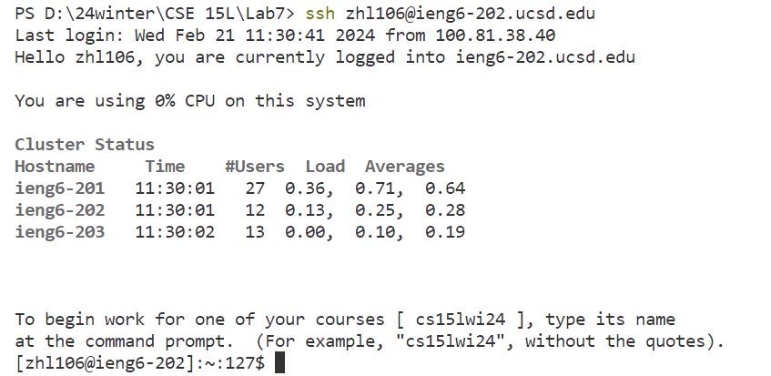
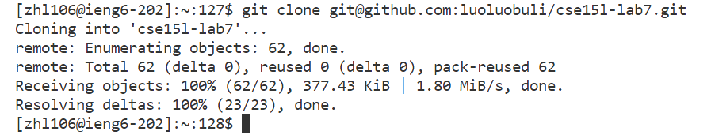
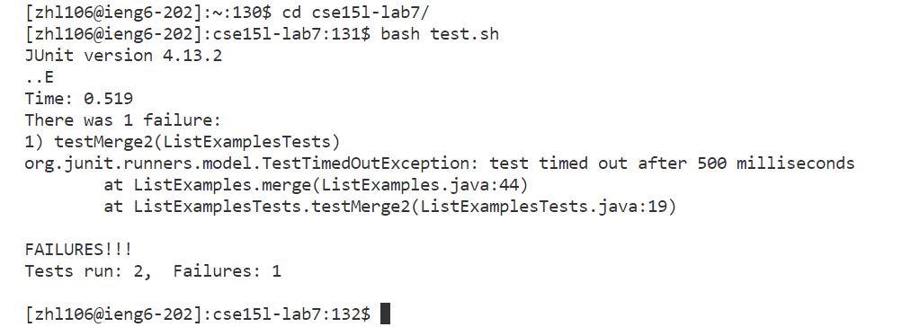
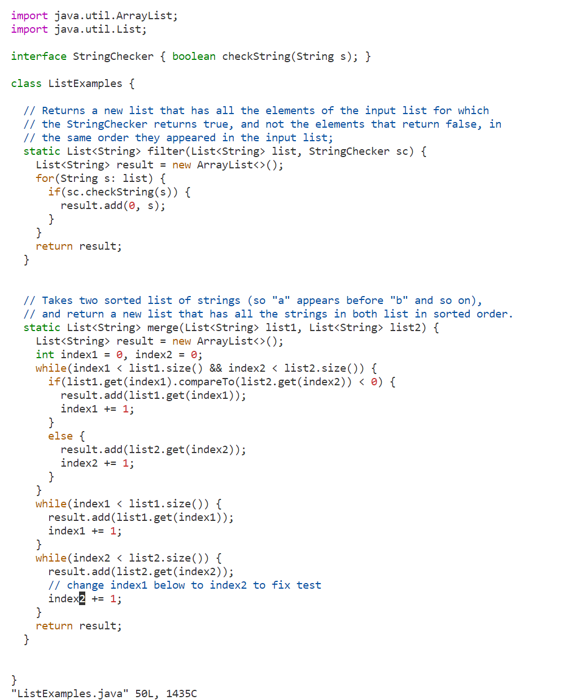
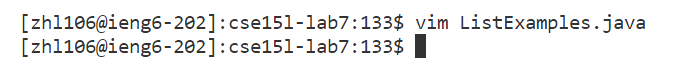
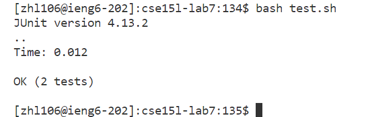
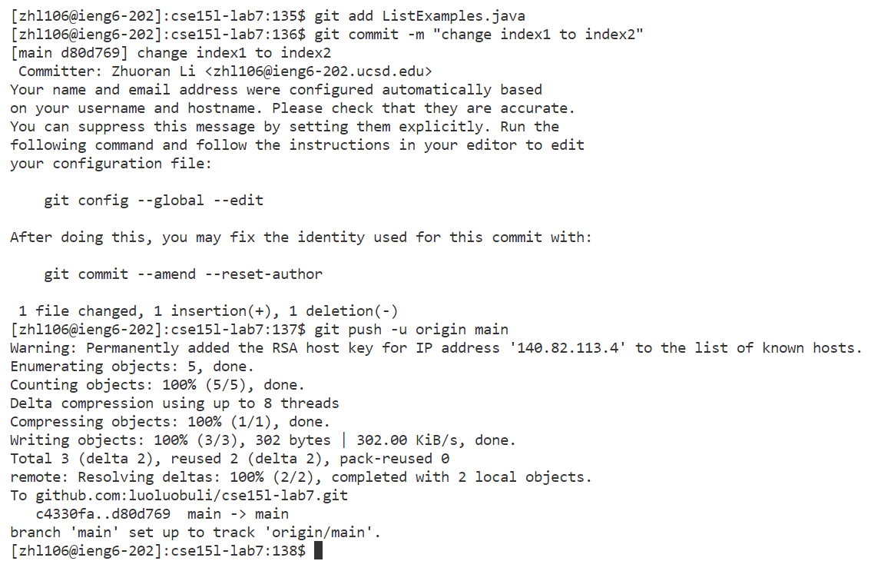

# Lab Report 4
### Step1: Log into ieng6
  
**Key pressed:** `ssh zhl106@ieng6-202.ucsd.edu<enter>`  
In the lab, I logged in ieng6.ucsd.edu and it has some problems, so this time I logged in ieng6-202.ucsd.edu, and thus I typed everything on my own.
### Step2: Clone your fork of the repository from your Github account (using the SSH URL)
  
**Key pressed:** `Ctrl R` `clone<enter>`  
I searched for the command `git clone git@github.com:luoluobuli/cse15l-lab7.git` I executed earlier in the command history.
### Step3: Run the tests, demonstrating that they fail
  
**Key pressed:** `cd cs<tab><enter>` `bash test.sh<enter>`  
I named the forked repository to cse15l-lab7, so I typed `cs` and `<tab>` to search for the directory. After that, I entered the bash script to run the test.
### Step4: Edit the code file to fix the failing test
  
  
**Key pressed:** `vim Li<tab>.java<enter>` `r2` `:wq<enter>`  
I typed `Li` to search for `ListExamples.java` and `ListExamples` pop out so I typed `.java` to complete it. For some reason the cursor was already on the character I needed to edit, so I directly pressed r2 to change "index1" to "index2."
### Step5: Run the tests, demonstrating that they now succeed
  
**Key pressed:** `bash test.sh<enter>`  
### Step6: Commit and push the resulting change to your Github account (you can pick any commit message!)
  
**Key pressed:** `Ctrl R` `add<enter>`  
I searched for the command `git add ListExamples.java` I executed earlier in the command history.  
**Key pressed:** `Ctrl R` `commi<enter>`  
I searched for the command `git commit -m "change index1 to index2"` I executed earlier in the command history.  
**Key pressed:** `Ctrl R` `push<enter>`  
I searched for the command `git push -u origin main` I executed earlier in the command history.
