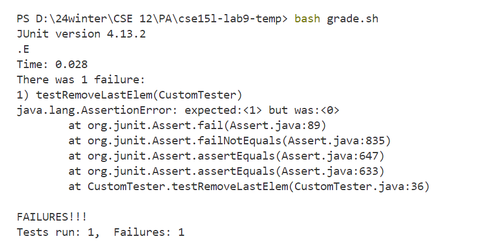
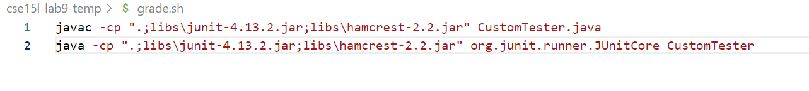
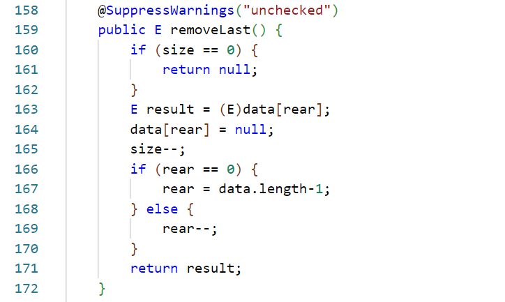
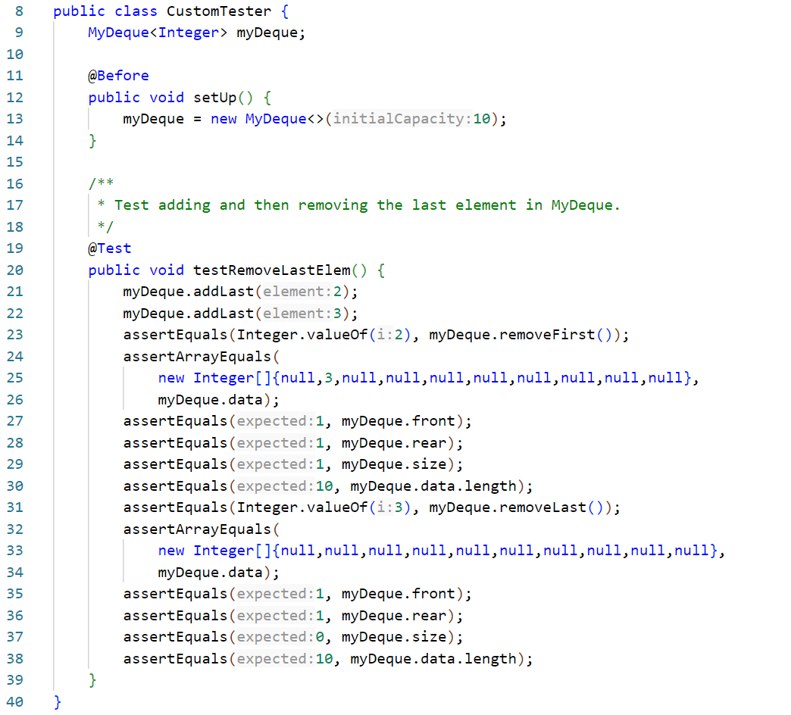
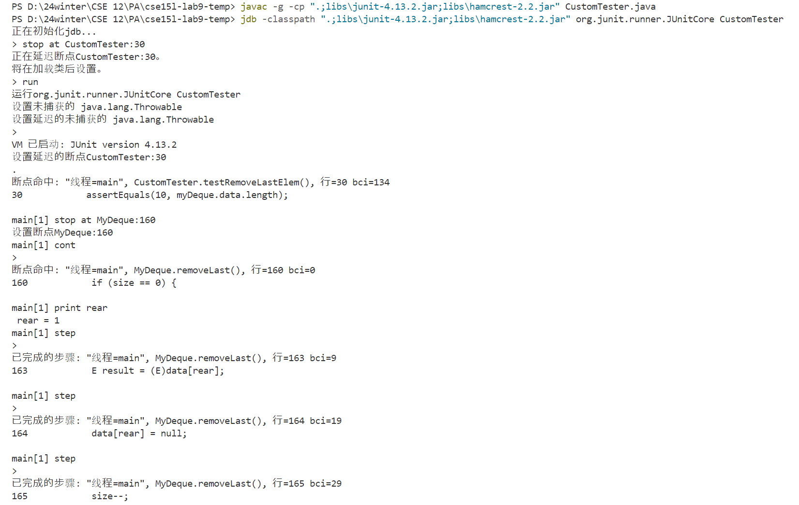
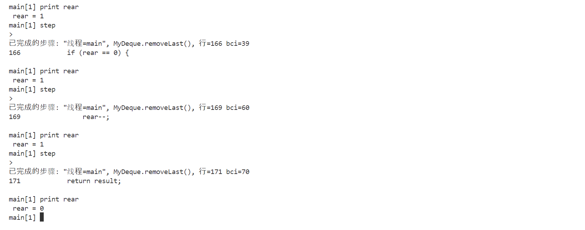
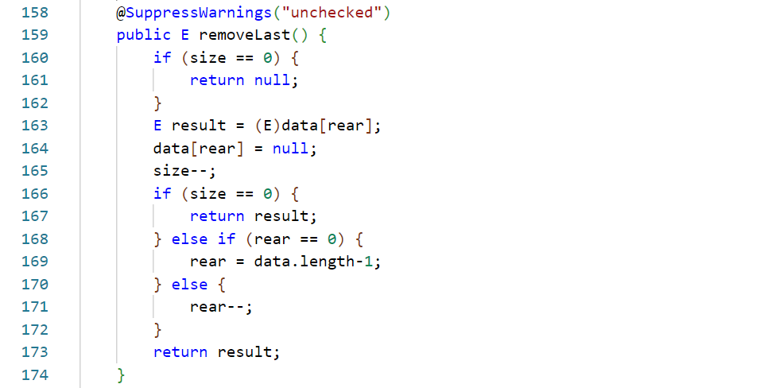
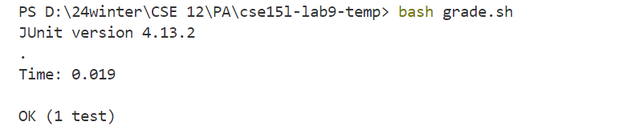
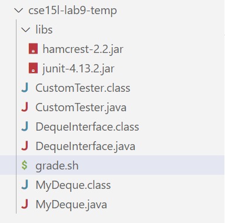

## Part 1 - Debugging Scenario
### Student's post:
I'm writing the method `removeLast` in `MyDeque` class and it failed the test when I ran my bash script, with error message shown in the screenshot. I guess that rear is not updated correctly, but I couldn't find the bug.  
**Error message:**  
  
**Bash script:**  
  
**My code and test:**  
  
  

### TA's reply:
You can try use `jdb` to help you find the bug. Use it to check `removeLast` step by step to see what is happening inside the method.  
Here's the commands you can try:
```
$javac -g -cp ".;libs\junit-4.13.2.jar;libs\hamcrest-2.2.jar" CustomTester.java
$jdb -classpath ".;libs\junit-4.13.2.jar;libs\hamcrest-2.2.jar" org.junit.runner.JUnitCore CustomTester
```
Then, set the stop point using `stop at` to look inside your method.  
Type `run`, and then keep doing `step` with `print rear` after each step to keep track of the variable.  
Then you might be able to find the logic mistake in your code.

### Student's update:
I tried the command you suggested and get the following output (sorry if it's hard to read; I cannot change my system's language so the terminal is Chinese):  

  
  
I realized that the rear was reduced from 1 to 0 because the code lacked the scenario of removing the last element from the array. Since there's no element in the array, it shouldn't execute `rear--` and reduce one index of the rear. To fix this, I added the situation when size is 0 after removal.  

  
I passed the test. 

  
The bug is fixed!  

### Wrap-up  
**Directory structure:**  
  
**Code with bug:**  
  
**Test:**  
  
**Bash script:**  
  
**Command line that triggers that bug:**  
`bash test.sh`  
**Description of fixing the bug:**  
Add the situation when `size == 1` after removal. If that's the case, return `result`, instead of deducting one index of `rear`.

ps. This was a real bug I met in CSE 12 and I couldn't find it until I asked for TA's help! I feel like jdb would definitely be a useful tool to understand what's going on inside the method and quickly address the bug!

## Part 2 - Reflection
I think the grading script is definitely one of the most interesting things I learned this quarter (although I can't write it well). I'm taking CSE 12 and using Gradescope to submit my programming assignments, and I always find it fun that the autograder just automatically catches everything in my code and gives a grade. However, writing script is kind of a difficult thing to me mostly because lack of practice I guess. I couldn't remember the syntax of bash script and I had to look it up online for every step I wrote, which was kind of frustrating. I do need more practice to get familiar with the concepts we talked about in this class.  
I feel like CSE 15l is a fun class and I'd recommand people to take it, though I heard that it will be replaced by CSE 29 :( Hope it would be as fun as this class!
