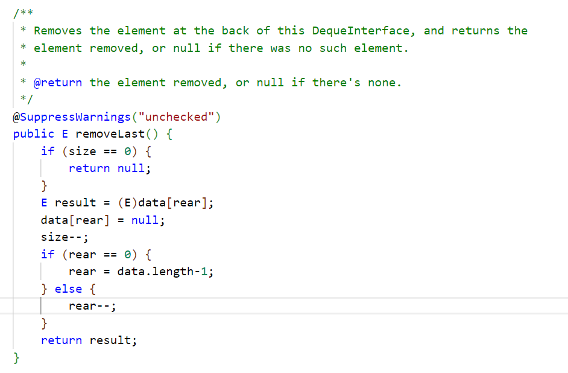

### Student's post:
I'm writing the method `removeLast` in `MyDeque` class and it failed the test when I ran my bash script, with error message shown in my screenshot. I also provided the code and script I wrote below. I guess that the rear is not updated correctly, but I couldn't find the bug. How should I fix my code?  
Error message:  
  
Code:  
  
Test:  
  
Bash script:  
  
Directory structure:  

### TA's reply:
You can try use `jdb` to help you find the bug. Use it to check `removeLast` step by step to see what is happening inside the method.

There's a class MyDeque and a method removeLast() in it. I have a tester class CustomTester and I call removeLast() in one of my tests. Now I want to use jdb to check inside removeLast() to see what is happening step by step. What should I do?
